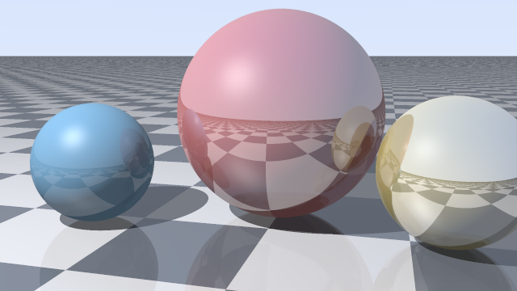

# trace-rays

A ray tracer in one Python file with no dependencies. It renders spheres on a
checkered floor with shadows, reflections and a specular highlight, and writes
the PNG itself.

    python raytracer.py -w 640 -s 3 -o render.png

Every pixel is one question asked backwards: instead of following light from
the lamp, send a ray out through that pixel and ask what it hits. A shadow is
the same question again from the surface toward the light, and a reflection is
the same question again from the surface along the bounce. Three uses of one
routine make the whole picture.

## What it does

- Ray and sphere intersection solved as a quadratic, ray and plane as one
  division, with the nearest positive hit winning.
- Lambert shading, a Blinn-Phong highlight, shadow rays, and reflections up to
  four bounces deep.
- A checkered floor that is just the parity of the floored coordinates.
- Grid supersampling, which is what removes the jagged edges.
- sRGB gamma, without which the whole image looks muddy.
- A PNG written by hand: header, scanline filter bytes, IDAT and the CRC on
  every chunk.

## Checking a picture

Pictures are hard to test, so the checks avoid looking at the picture. They
pin the geometry (a ray at a unit sphere two units away must hit at t=1, a
grazing ray must touch at one point, a ray pointing away must miss), compare
one floor point to itself with and without the sphere that shadows it, and
hand the PNG to Pillow, which is not my code, to read back.

Each check was proved able to fail by breaking one thing at a time: removing
the occlusion test, dropping the PNG scanline filter byte, swapping the
quadratic's roots, and flipping the surface normal. Each produced a different
failure.

    python test_raytracer.py

## Notes

[DOCS.md](DOCS.md) is what the maths taught me, including the two lines that
every ray tracer needs and nobody mentions.
